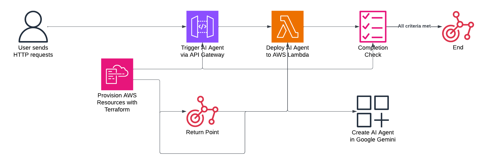

# Black Alert - Gemini AI-Powered Chat System

## Overview
Black Alert is a serverless chat system that leverages Google's Gemini AI API through AWS Lambda. The system provides a scalable, efficient way to interact with Gemini AI's advanced language model, with infrastructure managed through Terraform and automated deployments via BitBucket Pipelines.

## Cloud Architecture


*Note: Replace the above image path with your actual cloud architecture diagram.*

## Key Features
- **Serverless Architecture**: AWS Lambda-based deployment for optimal scaling and cost efficiency
- **Gemini AI Integration**: Direct integration with Google's latest Gemini AI model
- **Infrastructure as Code**: Complete Terraform-managed infrastructure
- **Automated CI/CD**: Streamlined deployment pipeline using BitBucket Pipelines
- **Error Handling**: Comprehensive error management and logging
- **CORS Support**: Built-in CORS configuration for web integration

## Technologies Used
- Python 3.12
- AWS Lambda
- Google Gemini AI API
- Terraform
- BitBucket Pipelines
- AWS API Gateway
- AWS S3

## Prerequisites
- AWS Account with appropriate permissions
- Google Cloud Platform account with Gemini AI API access
- Terraform installed locally
- Python 3.12
- BitBucket account for CI/CD

## Installation & Setup

### Local Development Setup
1. Clone the repository:
   ```bash
   git clone https://github.com/yourusername/black-alert-gemini-demo.git
   cd black-alert-gemini-demo
   ```

2. Create and activate virtual environment:
   ```bash
   python -m venv venv
   source venv/bin/activate  # On Windows: .\venv\Scripts\activate
   ```

3. Install dependencies:
   ```bash
   pip install -r requirements.txt
   ```

4. Set up environment variables:
   ```bash
   cp .env.example .env
   # Add your GEMINI_API_KEY and AWS credentials
   ```

### Infrastructure Setup
1. Initialize Terraform:
   ```bash
   cd infra
   terraform init
   ```

2. Apply Terraform configuration:
   ```bash
   terraform plan
   terraform apply
   ```

## Configuration
1. Configure AWS credentials
2. Set up Gemini AI API key
3. Update BitBucket pipeline variables:
   - AWS_ACCESS_KEY_ID
   - AWS_SECRET_ACCESS_KEY
   - AWS_DEFAULT_REGION
   - LAMBDA_NAME
   - ZIP_BUCKET

## Usage

### API Endpoint
POST request to your API Gateway endpoint:
```json
{
  "message": "Your message here"
}
```

Response:
```json
{
  "response": "AI generated response"
}
```

## Project Structure
```
black-alert/
├── infra/                  # Terraform infrastructure code
│   ├── modules/           # Reusable Terraform modules
│   ├── main.tf           # Main Terraform configuration
│   ├── lambdas.tf        # Lambda function configuration
│   └── rest_api.tf       # API Gateway configuration
├── lambda_function.py     # Main Lambda function code
├── requirements.txt       # Python dependencies
├── bitbucket-pipelines.yml # CI/CD configuration
└── docs/                  # Additional documentation
```

## Development

### Deployment Process
1. Push changes to the dev branch
2. BitBucket Pipeline automatically:
   - Builds the deployment package
   - Uploads to S3
   - Updates Lambda function

### Local Testing
Test the Lambda function locally using AWS SAM or direct Python execution:
```bash
python lambda_function.py
```

## Monitoring
- CloudWatch Logs for Lambda function monitoring
- API Gateway metrics
- Terraform state monitoring
- BitBucket Pipeline logs

## Security
- Environment variables for sensitive data
- IAM roles with least privilege
- API Gateway authentication (if configured)
- CORS policy implementation

## Contributing
1. Fork the repository
2. Create your feature branch (`git checkout -b feature/AmazingFeature`)
3. Commit your changes (`git commit -m 'Add some AmazingFeature'`)
4. Push to the branch (`git push origin feature/AmazingFeature`)
5. Open a Pull Request

## Support & Contact
For support and queries:
- Create an issue in the repository
- Contact the development team at [your-email@domain.com]

## License
This project is licensed under the MIT License - see the [LICENSE](LICENSE) file for details.

## Acknowledgments
- Google Cloud Platform and Gemini AI team
- AWS Lambda and Serverless community
- Terraform and HashiCorp
- BitBucket team for CI/CD capabilities
